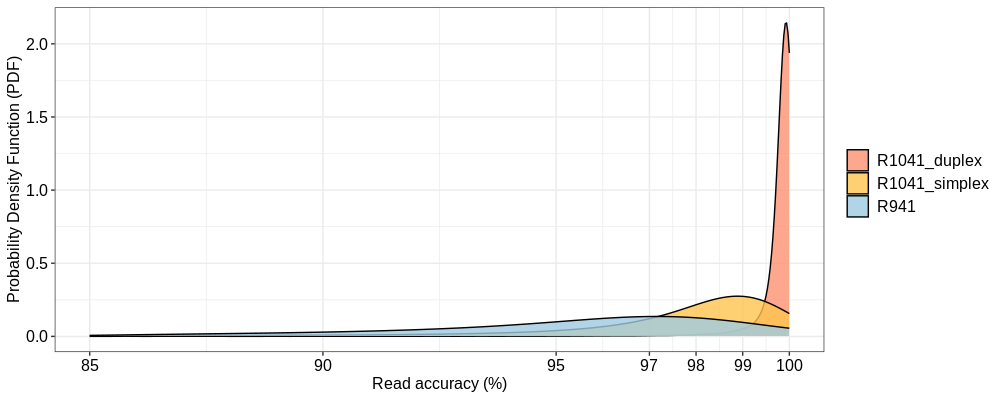
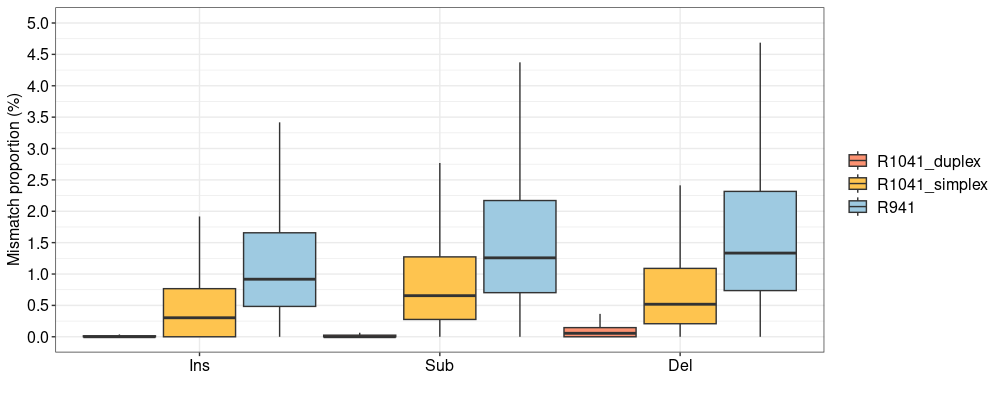
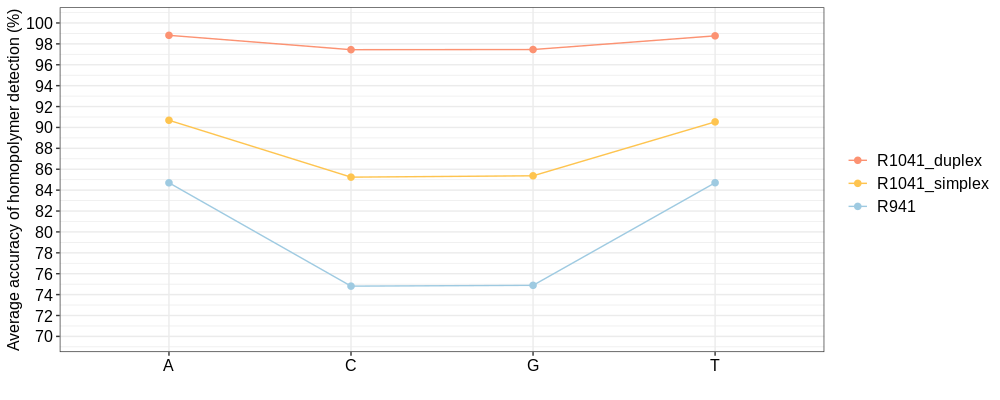

Demo of read accuracy table

```shell
bac	method	Ins	Del	Sub	Mat	Acc
Acinetobacter_pittii	R1041_duplex	4	22	2	9219	99.69719909159727
Acinetobacter_pittii	R1041_duplex	4	19	2	15342	99.83731372421423
Acinetobacter_pittii	R1041_duplex	5	4	1	7480	99.86648865153538
Acinetobacter_pittii	R1041_duplex	3	1	0	14555	99.97252558554845
Acinetobacter_pittii	R1041_duplex	6	10	1	11953	99.85797827903092
Acinetobacter_pittii	R1041_duplex	20	25	17	12249	99.49638534643815
Acinetobacter_pittii	R1041_duplex	7	17	1	24547	99.89825818004232
Acinetobacter_pittii	R1041_duplex	3	2	0	10805	99.95374653098982
Acinetobacter_pittii	R1041_duplex	4	5	2	12352	99.91102483216048
```

Demo of R code 

```R
ggplot(df, aes(x=Acc, fill=method)) + geom_density(adjust=10, alpha=0.8) + 
	scale_x_continuous(name="Read accuracy (%)", limits = c(85,100), breaks = c(85,90,95,97,98,99,100)) +
	scale_y_continuous(name="Probability Density Function (PDF)") + theme_bw() +
	scale_fill_manual(values=c("R941"="#9ecae1", "R1041_duplex"="#fc9272", "R1041_simplex" ="#fec44f")) +
	theme(axis.text=element_text(size=12, family = "Arial", color="black"),
        axis.title=element_text(size=12, family = "Arial", color="black"),
        legend.text = element_text(size=12, family = "Arial", color="black"),
        legend.title = element_blank())
```

Demo of figure for read accuracy





Demo of read mismatch table

```shell
method	type	value	length
R1041_duplex	Ins	4	9247
R1041_duplex	Ins	4	15367
R1041_duplex	Ins	5	7490
R1041_duplex	Ins	3	14559
R1041_duplex	Ins	6	11970
R1041_duplex	Ins	20	12311
R1041_duplex	Ins	7	24572
R1041_duplex	Ins	3	10810
R1041_duplex	Ins	4	12363
```

Demo of R code 

```R
df["ratio"] <- df["value"] / df["legth"]

ggplot(df1, aes(x=type, fill=method, y=ratio)) + 
	geom_boxplot(width=1,outlier.shape = NA, outlier.alpha = 0.1) + theme_bw() + xlab("") + 
	scale_y_continuous(name = "Mismatch proportion (%)", limits = c(0,5), breaks = seq(0,5,0.5)) +
	scale_fill_manual(values=c("R941"="#9ecae1", "R1041_duplex"="#fc9272", "R1041_simplex" ="#fec44f")) +
	theme(axis.text=element_text(size=12, colour = "black"),
        axis.title.y=element_text(size=12, colour = "black"),
        legend.text = element_text(size=12, colour = "black"),
        legend.title = element_blank())
```

Demo of figure for mismatch





Demo for homopolymer identification table

```shell
method	base	value
R1041_duplex	G	0.974576
R1041_duplex	T	0.987692
R1041_duplex	A	0.988185
R1041_duplex	C	0.974433
R941	G	0.748884
R941	T	0.84709
R941	A	0.847004
R941	C	0.748103
R1041_simplex	G	0.853731
```

Demo of R code 

```R
ggplot(df2, aes(x=base, y=value, group=method, color=method, )) +
	geom_point(size=2) + geom_line() + theme_bw() +
	scale_y_continuous(name="Average accuracy of homopolymer detection (%)", limits = c(70,100), breaks = seq(70,100,2)) + 
	scale_color_manual(values=c("R941"="#9ecae1", "R1041_duplex"="#fc9272", "R1041_simplex" ="#fec44f")) + xlab("") + 
	theme(axis.text=element_text(size=12, family = "Arial", color="black"),
        axis.title=element_text(size=12, family = "Arial", color="black"),
        legend.text = element_text(size=12, family = "Arial", color="black"),
        legend.title = element_blank())
```

Demo of figure for homopolymer accuracy



